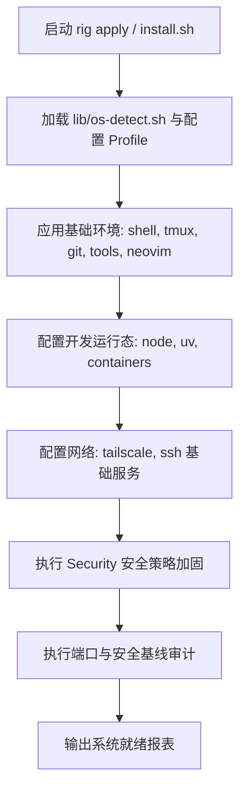
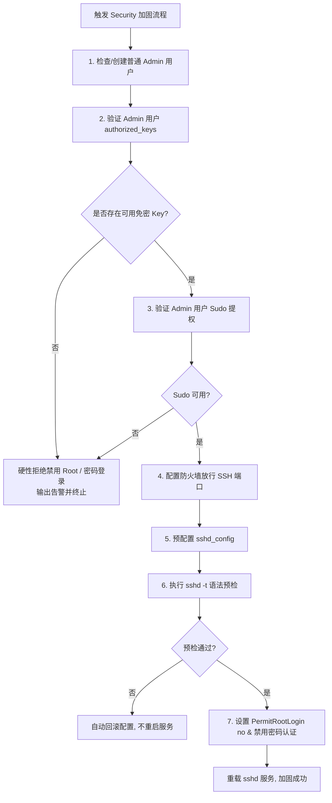
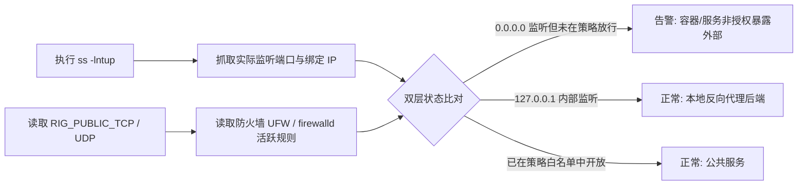

# AGENTS.md

Linux / macOS 自动化配置与轻量级 VPS 主机状态管理器 (Personal Server Baseline Manager)。

---

## 1. 目录结构

```text
rig/
├── AGENTS.md                # 项目唯一真实数据源与核心架构规范
├── README.md                # 英文说明文档
├── README_CN.md             # 中文说明文档
├── install.sh               # 交互式 TUI 与一键安装入口脚本
├── uninstall.sh             # 组件卸载脚本（含防误删保护）
├── update.sh                # 组件检查与一键更新
├── status.sh                # 组件安装/配置状态与版本表格展示
├── export-config.sh         # 本地配置导出与备份
├── import-config.sh         # 配置导入与多机同步
├── rig                      # 统一 CLI 前端入口 (~/.local/bin/rig)
├── setup-shell.sh           # Zsh + Starship 基础终端环境（非侵入）
├── setup-tmux.sh            # Tmux 终端复用配置（剪贴板自适应）
├── setup-git.sh             # Git 用户名、邮箱与全局推荐配置
├── setup-tools.sh           # 常用 CLI 基础工具链 (rg, jq, fd, fastfetch 等)
├── setup-node.sh            # Node.js 环境（双环境检测、防误删）
├── setup-uv.sh              # Python uv 工具链
├── setup-neovim.sh          # Neovim 现代轻量配置与默认编辑器
├── setup-containers.sh      # 容器引擎安装与配置 (Docker / Podman)
├── setup-tailscale.sh       # Tailscale 组网客户端
├── setup-ssh.sh             # OpenSSH 服务安装与客户端配置
├── setup-security.sh        # 安全加固核心模块（防 Lockout、防火墙、端口审计）
├── lib/                     # 共享逻辑库与抽象层
│   ├── os-detect.sh         # 操作系统与发行版探测
│   ├── pkg-manager.sh       # 跨包管理器安装抽象 (apt/dnf/pacman/brew)
│   ├── pkg-maps.sh          # 跨发行版软件包命名映射表
│   ├── containers.sh        # 容器通用检查与驱动分发
│   ├── docker.sh            # Docker / Docker Rootless 安装与配置
│   ├── podman.sh            # Podman 引擎安装与配置
│   ├── tools.sh             # 基础工具集安装逻辑
│   ├── rig-config.sh        # 统一配置读写与 Profile 管理
│   ├── firewall.sh          # 防火墙抽象层 (UFW / firewalld 统一管理)
│   ├── security.sh          # 账号安全、sshd 语法校验与端口审计逻辑
│   └── backup.sh            # 集中式配置备份管理库 (~/.local/share/rig/backups)
├── tests/                   # 自动化回归测试集
│   └── test-config-security.sh # 配置与安全策略自动化测试
└── docs/                    # 详细设计与使用文档
    ├── zh/                  # 中文文档
    └── ...                  # 英文文档
```

---

## 2. 核心处理流程图

### 2.1 主机状态应用流程



### 2.2 Security 防 Lockout 保护链



### 2.3 端口双层审计对比逻辑



### 2.4 现有配置文件比对与交互决策流 (Tmux 为例)

```mermaid
flowchart TD
    T0[运行 setup-tmux.sh] --> T1[按宿主环境生成推荐 Baseline]
    T1 --> T2{检测到既有配置文件?}
    T2 -- 否 --> T3[直接生成全新配置并提示剪贴板方案]
    T2 -- 是 --> T4[执行 git diff 输出彩色 Unified Diff]
    T4 --> T5{处于 TTY 交互终端?}
    T5 -- 否 --> T6[安全回退: 保留现有配置 (Keep), 仅输出建议]
    T5 -- 是 --> T7[交互菜单: [K]eep / [o]verwrite / [a]ppend / [d]iff]
    T7 -->|Keep| T6
    T7 -->|Overwrite| T8[集中备份至 ~/.local/share/rig/backups ➔ 全量覆盖为 Baseline]
    T7 -->|Append| T9[集中备份至 ~/.local/share/rig/backups ➔ 追加 Baseline 配置至末尾]
    T7 -->|Diff| T4
```

---

## 3. 具体程序用法

### 3.1 核心 CLI 命令

```bash
# 查看所有组件安装与配置状态
rig status

# 查看安全基线状态与端口审计
rig security status

# 应用指定主机配置 Profile（如个人 VPS 基线）
rig apply --profile vps

# 运行一键健康诊断
rig doctor

# 导出当前配置清单
rig export

# 一键卸载指定组件（含数据安全确认）
rig uninstall
```

### 3.2 VPS Profile 配置示例 (`~/.config/rig/profiles/vps.conf`)

```bash
# 组件清单
RIG_COMPONENTS="shell git tools neovim containers tailscale ssh security"

# 容器配置
RIG_CONTAINER_ENGINE="docker"
RIG_CONTAINER_MODE="rootless"

# SSH 与管理员加固
RIG_ADMIN_USER="cosimo"
RIG_SSH_PORT="22"
RIG_SSH_ROOT_LOGIN="no"
RIG_SSH_PASSWORD_AUTH="no"
RIG_SSH_PUBKEY_AUTH="yes"

# 防火墙策略 (auto: Debian/Ubuntu 用 ufw, Fedora/RHEL 用 firewalld)
RIG_FIREWALL="auto"
RIG_FIREWALL_DEFAULT_IN="deny"
RIG_FIREWALL_DEFAULT_OUT="allow"
RIG_PUBLIC_TCP="22"          # 80/443 等额外公网端口由用户显式选择
RIG_PUBLIC_UDP=""

# 端口审计
RIG_CHECK_LISTENING_PORTS="yes"
RIG_WARN_UNDECLARED_PORTS="yes"
```

### 3.3 Security 诊断与状态输出范例

```text
$ rig security status

Security Baseline
────────────────────────────────────────────────────────────
✔ Admin user           cosimo (sudo active)
✔ SSH root login       disabled (PermitRootLogin no)
✔ SSH password auth    disabled
✔ SSH public key       enabled (1 key verified)
✔ Firewall             ufw (active)
✔ Default inbound      deny
✔ Default outbound     allow
✔ Tailscale            active (100.x.y.z)

Listening Ports Audit
────────────────────────────────────────────────────────────
Proto  Port    Bind Address  Process    Policy Status
tcp    22      0.0.0.0       sshd       ✔ Allowed (public)
tcp    80      0.0.0.0       caddy      ✔ Allowed (public)
tcp    443     0.0.0.0       caddy      ✔ Allowed (public)
tcp    3000    127.0.0.1     node       ✔ Internal only
tcp    8080    0.0.0.0       docker     ⚠ WARN: Exposed but not in RIG_PUBLIC_TCP!

Warnings:
[!] Port 8080 bound to 0.0.0.0 without explicit declaration. Change to 127.0.0.1:8080 in docker-compose.
```
